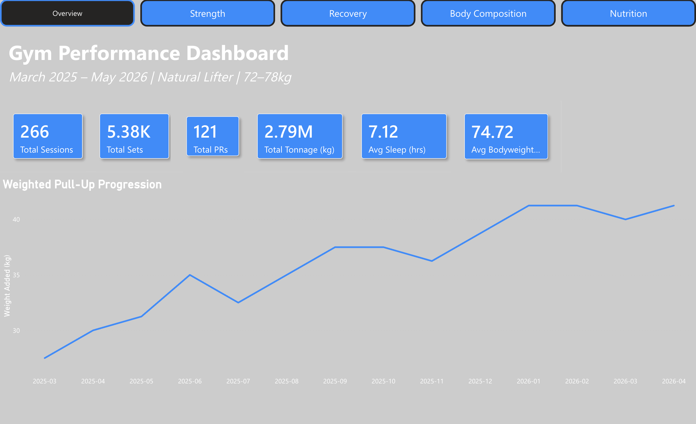
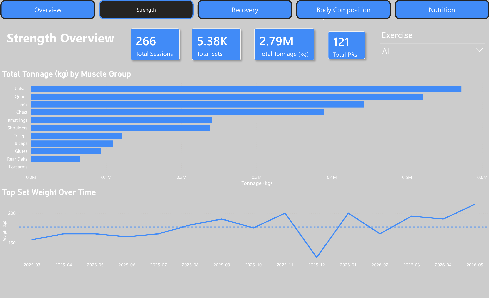
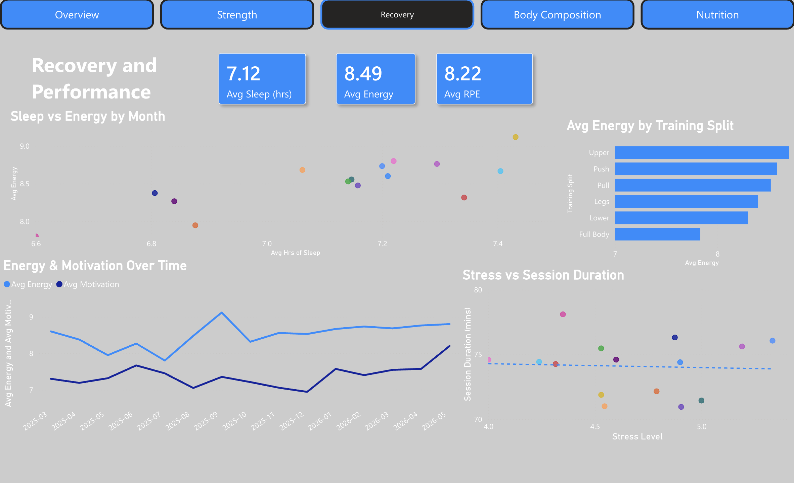
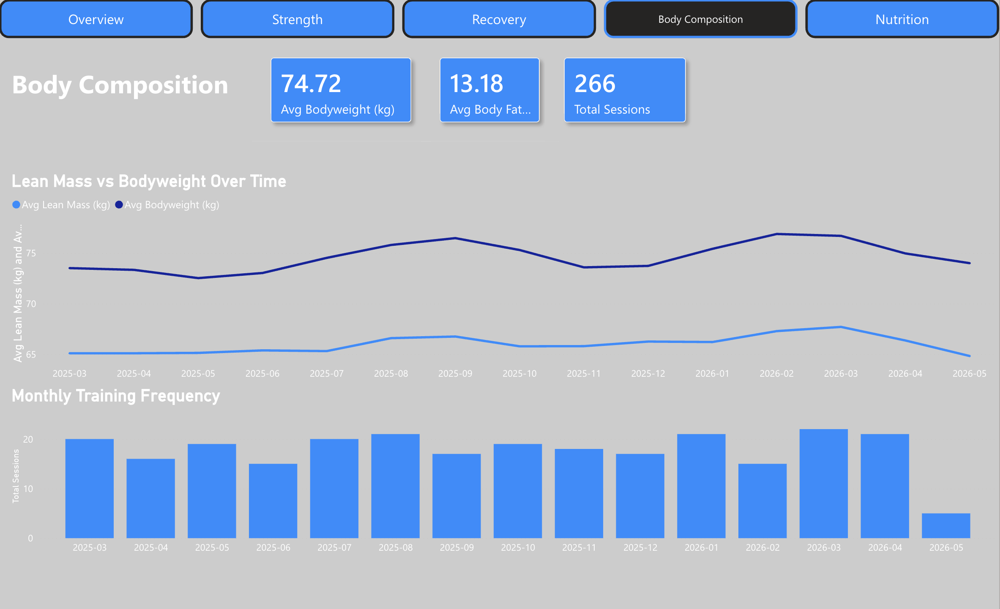
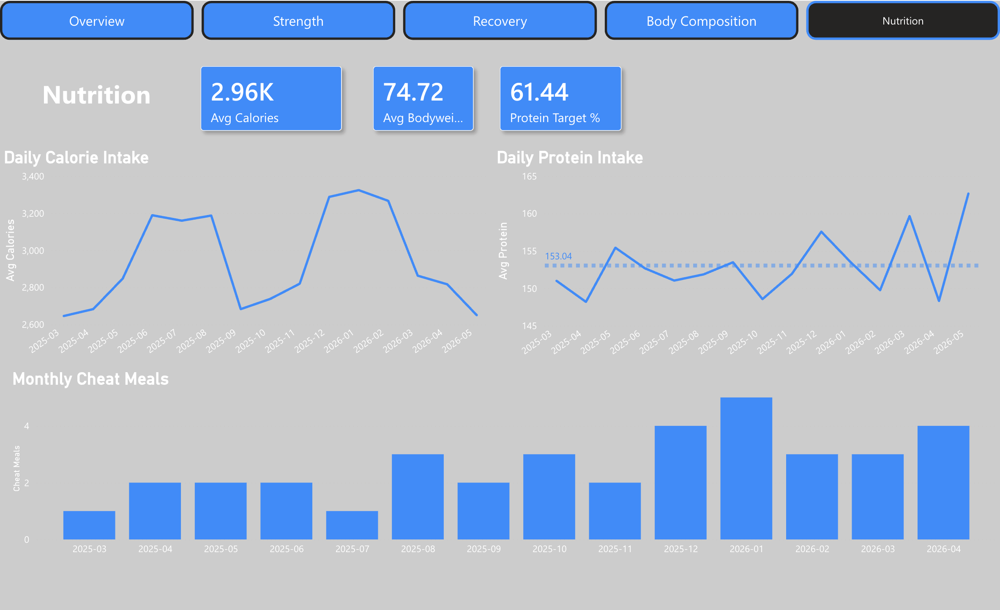

# Gym Performance Dashboard

A comprehensive end-to-end data analysis project that captures 14 months of data covering strength, recovery, body composition, and nutrition. Developed using Power BI Service utilizing a structured relational data model (star schema).



---

## Project Overview

This dashboard analyses the training data of a natural intermediate-to-advanced lifter (25M, 72–78kg) across the period **March 2025 – May 2026**. The goal was to demonstrate real-world data modelling, DAX measure writing, and multi-page dashboard design using Power BI.

The synthetic data set is designed to reflect real world human training patterns – plateau’s, deloading weeks, sickness/illness periods, vacation/holiday breaks, bulking/cutting phases, and PRs etc. allowing us to draw meaningful insights from the data.---

## Tools Used

| Tool | Purpose |
|---|---|
| Python (pandas, numpy) | Dataset generation |
| Microsoft Excel | Data storage and formatting |
| Power BI Service | Data modelling, DAX, dashboard design |
| GitHub | Version control and portfolio hosting |

---

## Dataset Structure

Five related tables modelled as a star schema with a `Dates` dimension table at the centre:

| Table | Rows | Description |
|---|---|---|
| `workout_log` | 266 | One row per session — split, duration, sleep, energy, bodyweight |
| `exercise_performance` | 5,380 | One row per set — exercise, weight, reps, RPE, PR flag |
| `body_metrics` | 306 | Bodyweight, body fat %, pump rating, confidence |
| `nutrition` | 389 | Calories, protein, water, cheat meals, supplements |
| `recovery_lifestyle` | 374 | Sleep quality, soreness, mood, alcohol, social events |

**Relationships:**
- `workout_log[session_id]` → `exercise_performance[session_id]` (1:many)
- All tables → `Dates[Date]` via date column (many:1)

---

## Dashboard Pages

### 1. Overview

Global KPIs and the headline visual — weighted pull-up progression from +27.5kg to +41kg over 14 months.

### 2. Strength

Exercise-level drill-down with filterable strength progression line chart, tonnage by muscle group, and session-level KPIs that respond to the exercise slicer.

### 3. Recovery & Performance

Sleep vs energy scatter, energy and motivation trends over time, average energy by training split, and stress vs session duration cross-analysis.

### 4. Body Composition

Lean mass vs bodyweight dual-line chart showing bulk/cut phases, body fat % trend, and monthly training frequency.

### 5. Nutrition

Daily calorie intake mirroring training phases, protein adherence vs 150g target, and monthly cheat meal frequency.

---

## Key Insights

- **Strength progressed non-linearly** — the average weight added to the heaviest lift (weighted pull-ups) for the top sets each month went up by an average of 49% per year, or from a total increase of +27.5 kg to +41 kg. However, there were also 2 regression periods and 3 periods of "plateau" that fit into this pattern, which is consistent with what would be expected when progressing through levels at which one may experience periods of progress and then less or even negative progress.
- **Sleep quality correlates with training energy** — on average, every month that had an average of 7.3+ hours of sleep averaged energy scores above 8.5+, and this can be seen visually on the Recovery page (Sleep vs. Energy).
- **Bulk/cut cycles are clearly visible across tables** — bodyweight, body fat %, and calorie intake all rise and fall in sync across three phases, with lean mass remaining relatively stable (65–67kg) throughout.
- **Protein target adherence was 61%** — despite a 150g/day target, roughly 4 in 10 days fell short, with the worst adherence during high-stress and holiday periods.
- **Cheat meal frequency peaks in winter** — January 2026 shows the highest monthly cheat meal count (5), coinciding with the holiday break visible as a training dip on the Body Composition page.
- **Training consistency held across events** — despite two illness periods, a summer holiday, and a Christmas break, monthly session count rarely dropped below 15, demonstrating the value of planned deloads over forced rest.

---

## DAX Measures

Key measures created in the semantic model:

```dax
Total Tonnage (kg) = 
SUMX(exercise_performance, exercise_performance[weight_kg] * exercise_performance[reps])

Avg Lean Mass (kg) = 
CALCULATE(
    AVERAGEX(body_metrics, body_metrics[bodyweight_kg] * (1 - body_metrics[body_fat_pct] / 100))
)

Protein Target % = 
DIVIDE(
    CALCULATE(COUNTROWS(nutrition), nutrition[protein_g] >= 150),
    COUNTROWS(nutrition), 0
) * 100

Total PRs = 
CALCULATE(COUNTROWS(exercise_performance), exercise_performance[pr_achieved] = "Yes")
```

---

## Dataset Note

The dataset was synthetically generated using Python to represent realistic training patterns for a natural intermediate lifter. It intentionally includes human inconsistencies: missed sessions, strength regressions, fatigue periods, bad nights of sleep, and motivational dips. It is not real personal data.
